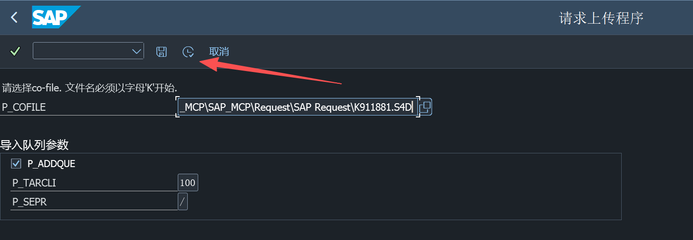
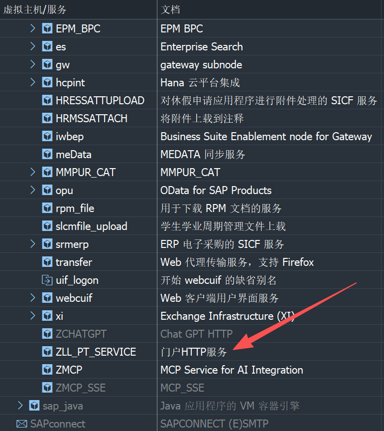
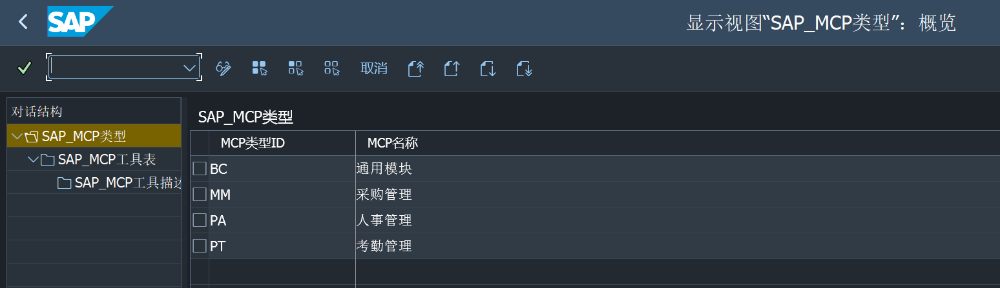

# SAP MCP 服务器

## 功能特性

### 核心功能

1. **AI 驱动的工具管理**：利用 AI 技术检索和管理 SAP_MCP 工具列表数据，实现智能工具发现和分类
2. **智能工具详情查询**：借助 AI 能力通过工具 ID 获取全面的工具详情，包括结构化的输入/输出参数和使用模式
3. **AI 增强的工具执行**：应用 AI 驱动的数据转换将输入转换为 SAP 可识别的格式，调用 SAP_MCP 工具提供优化的执行结果

该项目利用 AI 技术将 SAP 系统工具发布为 MCP 服务，为将前沿 AI 能力集成到 SAP 系统中提供了可行的解决方案。

### Web 管理界面

1. **服务状态管理**：
   - 查看 MCP 服务运行状态
   - 启动/停止 MCP 服务
   - 实时查看服务日志
   - 端口占用检测和冲突处理

2. **配置管理**：
   - SAP 系统配置（Base URL、Client ID、用户名、密码、超时）
   - MCP 服务器配置（主机、端口、路径）
   - 实时配置文件保存

3. **工具管理**：
   - 浏览和搜索 SAP MCP 工具
   - 查看工具详情和参数
   - 通过交互式表单执行工具

4. **日志管理**：
   - 查看带有过滤选项的日志
   - 确认后清除日志
   - 实时日志更新

## 部署

### 前置条件

- Python 3.8 或更高版本
- Git（可选，用于克隆仓库）
- 网络连接（用于安装依赖）
- 拥有SAP系统管理员权限

### SAP Http接口服务激活

在安装本项目前，需要在SAP系统中激活Http接口服务。请按照以下步骤操作：

1. 步骤1： SAP系统程序代码导入-SAP请求导入程序，地址在 Request\SAP REQUEST\Y_UPLOAD_TRANSPORT_REQUEST.md
   
2. 步骤2： 执行SAP请求导入程序，导入开发包


3. 步骤3： SICF激活ZMCP服务，并测试服务正常使用


4. 步骤4： 事务码ZMCP_CONFIG配置SAP工具列表


### 1. 手动部署

#### 1.1 获取项目代码

**方法 1：从 Git 仓库克隆**
```bash
git clone https://github.com/MarkWuRY168/SAP_MCP
cd SAP_MCP
```

**方法 2：直接复制文件**
- 将整个项目文件夹复制到您的服务器
#### 1.2 创建虚拟环境

```bash
# 创建虚拟环境
python -m venv venv

# 激活虚拟环境
# Windows
venv\Scripts\activate
# Linux/Mac
source venv/bin/activate
```

#### 1.3 安装依赖

```bash
# 升级 pip
python -m pip install --upgrade pip

# 安装项目依赖
pip install -r requirements.txt

# 安装项目
pip install -e .
```

#### 1.4 配置项目

```bash
# 复制配置示例文件
cp config.example.py config.py

# 编辑配置文件（根据您的环境修改）
# 您可以使用任何文本编辑器，例如
# notepad config.py      # Windows
# vim config.py          # Linux/Mac
```

**配置文件示例：**
```python
# SAP 接口配置
SAP_CONFIG = {
    "base_url": "http://your-sap-server:port/sap/zmcp",
    "client_id": "your-client-id",
    "sap-user": "your-sap-username",
    "sap-password": "your-sap-password",
    "timeout": 30
}

# MCP 服务器配置
MCP_SERVER_CONFIG = {
    "host": "0.0.0.0",
    "port": 8000,
    "path": "/mcp"
}
```

#### 1.5 启动服务

##### 方法 1：仅启动 MCP 服务器

```bash
# 启动 MCP 服务器
python server/sap_mcp_server.py
```

##### 方法 2：启动 Web 管理界面

```bash
# 启动 Web 管理界面
python -m uvicorn web.main:app --host 0.0.0.0 --port 8080
```

### 2. Docker 部署

#### 2.1 前置条件

- 系统已安装 Docker
- 系统已安装 Docker Compose
- 网络连接正常（需要访问 Docker Hub）

#### 2.2 使用 Docker Compose 构建和运行

```bash
# 进入 Docker 文件夹
cd Docker

# 构建并运行所有服务
docker-compose up -d

# 查看所有服务的日志
docker-compose logs -f

# 查看特定服务的日志
docker-compose logs -f sap-mcp-web

# 停止所有服务
docker-compose down

# 停止并移除卷
docker-compose down -v
```

#### 2.3 常见问题解决

**问题 1：无法连接到 Docker Hub**

如果遇到类似以下的错误：
```
failed to do request: Head "https://registry-1.docker.io/v2/library/ubuntu/manifests/22.04": dial tcp: connectex: A connection attempt failed
```

**解决方案：**

1. **检查网络连接**：确保您的网络可以访问 Docker Hub
2. **配置 Docker 镜像加速器**（推荐）：
   - 打开 Docker Desktop
   - 进入 Settings > Docker Engine
   - 添加以下配置：
   ```json
   {
     "registry-mirrors": [
       "https://docker.mirrors.ustc.edu.cn",
       "https://hub-mirror.c.163.com",
       "https://mirror.baidubce.com"
     ]
   }
   ```
   - 点击 "Apply & Restart"

3. **使用代理**（如果需要）：
   - 打开 Docker Desktop
   - 进入 Settings > Resources > Proxies
   - 配置您的代理服务器

4. **手动拉取镜像**：
   ```bash
   docker pull ubuntu:22.04
   docker-compose up -d
   ```

**问题 2：构建失败**

如果构建过程中出现错误，可以尝试：

```bash
# 清理之前的构建缓存
docker-compose down
docker system prune -a

# 重新构建
docker-compose up -d --build
```

### 服务

- **sap-mcp-server**: SAP MCP 服务器运行在端口 8000
- **sap-mcp-web**: Web 管理界面运行在端口 8080

### 访问应用

1. **Web 管理界面**: 打开浏览器并导航到 `http://localhost:8080`
2. **MCP 服务器**: 服务器可通过 `http://localhost:8000/mcp` 进行客户端连接

### 配置

`config.py` 文件被挂载为两个容器的卷，因此您可以在主机上修改它，更改将反映在容器中。

### 日志

日志存储在名为 `log_volume` 的 Docker 卷中，可从容器内的 `/app/log/sap_api.log` 访问。

### 自定义

您可以通过修改 `Docker` 文件夹中的以下文件来自定义 Docker 配置：

- `Dockerfile`: 用于自定义基础镜像和构建过程
- `docker-compose.yml`: 用于自定义服务、端口、卷和环境变量
- `.dockerignore`: 用于从 Docker 构建上下文中排除文件

## 开发者

- **产品设计**: Mark (Wu Rangyu)
- **开发者**: Mark (Wu Rangyu)
- **电话**: 18685095797
- **QQ**: 121980331
- **邮箱**: 121980331@qq.com

## 许可证

本项目采用 [MIT 许可证](LICENSE)。
